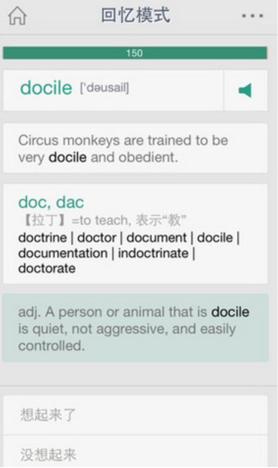

###iRecite__一款背单词应用
向仁楷 2015/06/01

####1.简介
我们要做的是一款在PC上运行的有图形交互界面的单词记忆软件,跟扇贝单词类似.它可以加载我们的词库,根据设定的学习时间长度安排每天的背诵量.具体的记忆方式和扇贝单词一样,首先会显示英文单词,然后下面有按钮"想起来了"和"没想起来".
点想起来了会出现完整解释并提示进入下一个单词,点击没想起来会先显示例句,如果还没想起来则会显示完整提示.

####2.项目分工
UI设计+开发=2人
内部逻辑实现=1.5人
词库收集整理=0.5人
撰写报告=1.5人
额外功能(比如微博打卡)=0.5人

####3.项目执行
6月2日~16日,项目Git位置https://github.com/dydcfg/iRecite
2号我们会讨论相关的DDL
